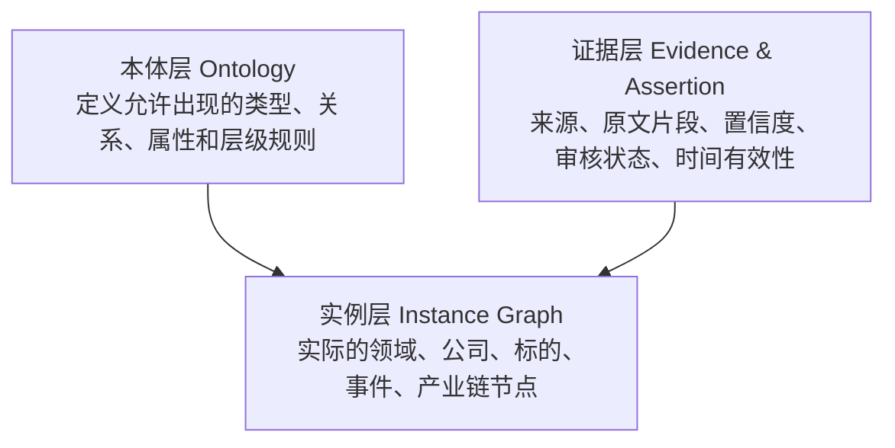
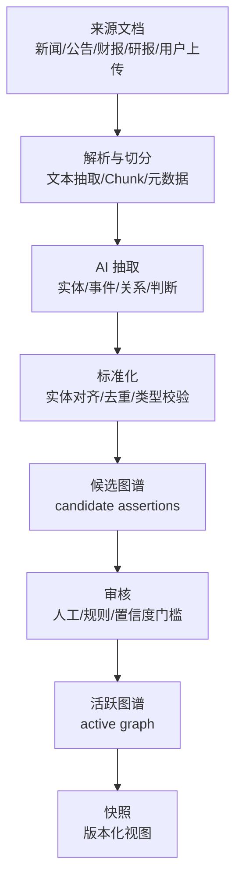

# AI Vantage 知识图谱数据模型设计

## 一、设计目标

AI Vantage 的知识图谱不应该只是一个静态产业链展示图，而应该成为平台的核心研究资产：

- 能表达 AI 产业中的领域、主题、产业链、公司、投资标的、事件、指标和文档。
- 能持续吸收最新信息，并把新闻、公告、财报、研报等材料转化为结构化图谱。
- 能支持 AI 自动生成候选实体、关系和判断，同时保留人工维护、审核和纠错能力。
- 能追溯每一条图谱信息的来源、证据、置信度、生成时间和审核状态。
- 能支持投资研究场景下的动态变化，例如产业链位置变化、投资逻辑增强或削弱、事件影响扩散。

核心原则：

> 图谱中可被使用的内容不是“AI 说了什么”，而是“实体 + 关系 + 判断 + 证据 + 时间 + 状态”。

---

## 二、整体分层

知识图谱建议分为三层：本体层、实例层、证据层。



### 2.1 本体层 Ontology

本体层定义系统如何理解投资世界。

它回答的是：

- 有哪些节点类型？
- 有哪些关系类型？
- 每类节点允许有哪些属性？
- 哪些关系可以连接哪些类型？
- 哪些关系可以形成层级？
- 哪些信息需要人工审核？

本体层应该相对稳定，主要由人工维护。AI 可以提出新增本体的建议，但不应该直接自动生效。

### 2.2 实例层 Instance Graph

实例层是实际图谱。

例如：

- `AI 算力` 是一个领域。
- `HBM` 是一个技术/产品/产业链环节。
- `英伟达` 是一家公司。
- `NVDA.US` 是一个投资标的。
- `Blackwell 延期交付` 是一个事件。
- `英伟达 depends_on 台积电先进制程` 是一条关系。

实例层可以由 AI 自动生成候选内容，但需要带上来源、置信度和状态。

### 2.3 证据层 Evidence & Assertion

证据层用于解决可信度和可维护性问题。

图谱中的每条重要关系和判断，都应该能追溯到：

- 来源文档
- 原文片段
- 抽取模型
- 生成时间
- 置信度
- 审核状态
- 是否仍然有效

例如：

```text
Assertion:
  subject: 工业富联
  predicate: benefits_from
  object: AI 服务器需求增长
  claim_text: 工业富联受益于 AI 服务器需求增长
  evidence: 财报/公告/新闻/研报中的原文片段
  confidence: 0.82
  status: candidate
```

---

## 三、核心对象模型

第一版建议将核心模型控制在六个对象内：

```text
Entity
Relation
Assertion
Evidence
OntologyType
Snapshot
```

### 3.1 Entity

`Entity` 是图谱节点，表示一个可被识别、连接、查询和维护的对象。

典型实体类型：

| 类型 | 说明 | 示例 |
|---|---|---|
| Domain | 领域 | AI 算力、半导体、云计算 |
| Theme | 投资主题 | AI 服务器、液冷、HBM、端侧 AI |
| Industry | 行业 | 半导体设备、云服务、服务器制造 |
| SubIndustry | 子行业 | GPU、先进封装、光模块 |
| SupplyChainStage | 产业链环节 | 上游材料、中游制造、下游云厂商 |
| Company | 公司主体 | NVIDIA、台积电、工业富联 |
| Instrument | 投资标的 | NVDA.US、2330.TW、601138.SH |
| Product | 产品 | GPU、AI 服务器、交换机 |
| Technology | 技术 | CoWoS、HBM3E、液冷 |
| Event | 事件 | 财报发布、订单变更、政策发布 |
| Metric | 指标 | 毛利率、资本开支、库存、交付周期 |
| Policy | 政策 | 出口管制、产业补贴 |
| Document | 来源文档 | 新闻、公告、财报、研报、访谈 |
| Person | 人物 | CEO、分析师、监管官员 |
| Region | 地区 | 美国、中国台湾、日本、欧洲 |

建议区分 `Company` 和 `Instrument`。

```text
Company: NVIDIA Corporation
Instrument: NVDA.US
Relation: NVIDIA Corporation listed_as NVDA.US
```

这样可以避免把“公司主体”和“可交易标的”混在一起，也方便未来支持港股、A 股、美股、ETF、债券、基金等不同资产。

### 3.2 Relation

`Relation` 是实体之间的结构化关系。

关系应该是有类型、有方向、可解释、可追溯的。

第一版建议关系类型控制在 15 到 20 个：

| 关系 | 含义 | 示例 |
|---|---|---|
| belongs_to | 归属 | HBM belongs_to 存储芯片 |
| contains | 包含 | AI 算力 contains GPU |
| listed_as | 上市标的 | NVIDIA listed_as NVDA.US |
| produces | 生产 | 工业富联 produces AI 服务器 |
| supplies_to | 供应给 | 台积电 supplies_to NVIDIA |
| customer_of | 是客户 | NVIDIA customer_of 台积电 |
| competes_with | 竞争 | AMD competes_with NVIDIA |
| upstream_of | 上游 | HBM upstream_of AI 服务器 |
| downstream_of | 下游 | 云厂商 downstream_of GPU |
| depends_on | 依赖 | GPU depends_on HBM |
| enables | 使能 | 液冷 enables 高密度数据中心 |
| benefits_from | 受益于 | 工业富联 benefits_from AI 服务器需求增长 |
| hurt_by | 受损于 | 某公司 hurt_by 出口管制 |
| affected_by | 受影响 | 半导体设备 affected_by 出口政策 |
| mentions | 提及 | 财报 mentions AI 服务器 |
| supports | 支持 | 某事件 supports AI 算力景气逻辑 |
| contradicts | 反驳 | 某事件 contradicts 高增长预期 |
| changes_metric | 改变指标 | 财报事件 changes_metric 毛利率 |

关系不应只存一条边，还应保存来源、置信度、状态和有效期。

### 3.3 Assertion

`Assertion` 是一条可验证的事实、判断或推断。

它是动态 AI 生成图谱的关键对象。

不是所有图谱内容都天然是确定事实。投资研究中大量内容属于判断，例如：

- “HBM 是 AI 算力产业链的关键瓶颈。”
- “液冷需求受到高密度机柜增长驱动。”
- “某公司受益于北美云厂商资本开支扩张。”
- “某事件削弱了某投资主题的短期确定性。”

这些内容应该作为 `Assertion` 存储。

建议字段：

| 字段 | 说明 |
|---|---|
| subject_entity_id | 主体实体 |
| predicate | 判断/关系类型 |
| object_entity_id | 客体实体，可为空 |
| claim_text | 自然语言判断 |
| confidence | 置信度 |
| status | 状态 |
| evidence_ids | 支撑证据 |
| generated_by | 生成模型或规则 |
| reviewed_by | 审核人 |
| valid_from | 生效时间 |
| valid_to | 失效时间 |
| created_at | 创建时间 |
| updated_at | 更新时间 |

状态建议：

```text
extracted -> candidate -> verified -> active
                         -> rejected
                         -> deprecated
```

### 3.4 Evidence

`Evidence` 是证据对象，表示一条判断或关系的来源。

证据可以来自：

- 新闻
- 公司公告
- 财报
- 电话会纪要
- 研报
- 行业报告
- 政策文件
- 用户上传文档
- 平台已有文章

建议字段：

| 字段 | 说明 |
|---|---|
| source_type | 来源类型 |
| source_title | 来源标题 |
| source_url | 来源链接 |
| publisher | 发布方 |
| published_at | 发布时间 |
| ingested_at | 入库时间 |
| raw_text | 原文或解析文本 |
| evidence_span | 支撑判断的原文片段 |
| page_number | 页码，可选 |
| author | 作者，可选 |
| reliability_score | 来源可信度 |

证据层的价值在于：当 AI 生成错误关系时，系统可以快速定位错误来自哪里。

### 3.5 OntologyType

`OntologyType` 用于维护类型体系。

它可以包括：

- 实体类型定义
- 关系类型定义
- 属性定义
- 关系约束
- 层级规则
- 可视化样式
- 审核策略

例如：

```text
RelationType: supplies_to
  from_types: Company | Product | SupplyChainStage
  to_types: Company | Product | SupplyChainStage
  directed: true
  requires_evidence: true
  default_review_policy: candidate_before_active
```

### 3.6 Snapshot

`Snapshot` 用于保存某一时间点的图谱状态。

投资研究中的知识图谱会持续变化，因此需要支持：

- 历史回看
- 版本对比
- 事件前后关系变化
- 投资逻辑演化
- AI 自动更新后的回滚

例如：

```text
Snapshot: 2026-Q2 AI 算力产业链图谱
  scope: AI Infrastructure
  entity_count: 128
  relation_count: 436
  generated_from: verified assertions before 2026-06-30
```

---

## 四、领域、投资主题与产业链模型

### 4.1 领域 Domain

`Domain` 是最高层的研究范围。

示例：

```text
AI Infrastructure
AI Applications
Semiconductor
Cloud Computing
Autonomous Driving
Robotics
```

一个领域下面可以有多个投资主题、行业、产业链和标的。

### 4.2 投资主题 Theme

`Theme` 表示投资研究中的逻辑聚合。

示例：

```text
AI 服务器
HBM 供需紧张
先进封装扩产
液冷渗透率提升
云厂商资本开支周期
端侧 AI 换机周期
国产算力替代
```

主题不是简单分类，而是投资逻辑的容器。

一个主题可以连接：

- 相关领域
- 相关产业链环节
- 相关公司
- 相关标的
- 支撑事件
- 反驳事件
- 核心指标
- 风险因素

示例：

```text
Theme: HBM 供需紧张
  belongs_to: AI Infrastructure
  related_to: GPU
  related_to: AI 服务器
  benefits: SK 海力士
  benefits: 美光
  benefits: 三星电子
  depends_on: 云厂商资本开支
  tracked_by: HBM 合约价
  tracked_by: 产能利用率
```

### 4.3 产业链 Supply Chain

产业链不建议只做树形结构，而应该做成可多父级、多视角的图结构。

原因是一个节点可能同时属于多个视角：

- `HBM` 既属于存储芯片，也属于 AI 算力上游。
- `CoWoS` 既属于先进封装，也属于 GPU 供给约束。
- `光模块` 既属于数据中心网络，也属于 AI 集群扩展。

产业链可以用 `SupplyChainStage` 表示环节，用关系表达上下游。

示例：

```text
Domain: AI Infrastructure

上游:
  半导体设备
  晶圆制造
  HBM
  先进封装
  材料

中游:
  GPU
  AI 服务器
  交换机
  光模块
  液冷
  电源

下游:
  云厂商
  大模型公司
  企业 AI 应用
```

关系示例：

```text
HBM upstream_of GPU
GPU upstream_of AI 服务器
AI 服务器 upstream_of 云厂商
液冷 enables 高密度数据中心
CoWoS depends_on 先进封装产能
台积电 supplies_to NVIDIA
工业富联 produces AI 服务器
```

### 4.4 层级 Hierarchy

层级不要只用 `parent_id`，建议用显式关系。

```text
AI 算力 contains GPU
GPU depends_on HBM
HBM belongs_to 存储芯片
HBM belongs_to AI 算力产业链上游
```

这样可以支持：

- 同一实体出现在多个层级中
- 不同投资视角下的不同归属
- 动态重组图谱
- 按主题、行业、产业链、标的多维查看

---

## 五、最新信息与事件模型

### 5.1 Event

“最新信息”不应该只是新闻列表，而应该抽象成事件。

事件是研究系统里的时间型节点。

事件类型建议：

| 类型 | 示例 |
|---|---|
| EarningsEvent | 财报发布、业绩指引调整 |
| OrderEvent | 大客户订单、订单取消 |
| ProductEvent | 新产品发布、延期交付 |
| PolicyEvent | 出口管制、补贴政策 |
| PriceEvent | 产品涨价、降价 |
| CapacityEvent | 扩产、停产、良率提升 |
| PartnershipEvent | 战略合作、供应协议 |
| FinancingEvent | 融资、并购、回购 |
| MarketEvent | 股价异动、成交放量 |
| RiskEvent | 监管调查、供应链中断 |

### 5.2 事件关系

事件应该连接到实体、主题、指标和判断。

示例：

```text
Event affects Company
Event affects Industry
Event supports Theme
Event contradicts Theme
Event changes_metric Metric
Event mentions Product
Event increases_risk_of Theme
```

示例场景：

```text
Event: 某云厂商上调 2026 年资本开支
  affects: AI 算力
  supports: AI 服务器需求增长
  benefits: NVIDIA
  benefits: 工业富联
  changes_metric: 云厂商 CapEx
  evidence: 财报电话会原文
```

### 5.3 信息新鲜度

每条事件和判断都应该有时间属性：

- `event_time`: 事件发生时间
- `published_at`: 信息发布时间
- `ingested_at`: 系统入库时间
- `valid_from`: 判断开始有效时间
- `valid_to`: 判断失效时间

投资图谱不是静态百科，很多判断会过期。

例如：

```text
Assertion: HBM 供给紧张
  valid_from: 2024-01-01
  valid_to: null
  freshness_score: 0.74
```

如果之后出现扩产超预期、价格下跌、库存增加等事件，系统应该生成新的 `Assertion`，并可能将旧判断标记为 `deprecated`。

---

## 六、AI 动态生成机制

### 6.1 AI 生成的边界

AI 可以自动生成：

- 候选实体
- 候选关系
- 候选事件
- 候选产业链位置
- 候选主题归属
- 候选投资判断
- 实体合并建议
- 关系冲突提示
- 过期信息提示

AI 不应该自动完成：

- 高置信投资结论的最终确认
- 本体结构的直接变更
- 关键标的的强关系覆盖
- 已审核内容的静默删除
- 无证据的事实写入

建议规则：

```text
AI 负责生成候选
系统负责结构校验
证据负责可信度约束
人负责关键内容确认
```

### 6.2 生成流程



### 6.3 置信度建议

每个候选关系或判断可以有综合置信度：

```text
confidence =
  model_confidence
  * source_reliability
  * evidence_strength
  * consistency_score
  * freshness_score
```

说明：

| 维度 | 含义 |
|---|---|
| model_confidence | 模型抽取时的信心 |
| source_reliability | 来源可信度，公告和财报高于普通新闻 |
| evidence_strength | 原文是否明确支持该判断 |
| consistency_score | 是否与已有图谱一致 |
| freshness_score | 信息是否足够新 |

### 6.4 冲突处理

图谱中允许存在冲突，但必须显式记录。

示例：

```text
Assertion A:
  claim: HBM 供给仍然紧张
  status: active
  confidence: 0.78

Assertion B:
  claim: HBM 供给紧张程度正在缓解
  status: candidate
  confidence: 0.69
  contradicts: Assertion A
```

冲突不是坏事。对于投资研究，冲突往往是重要信号。

系统应该支持：

- 展示冲突判断
- 对比证据来源
- 标记哪条判断更可信
- 将旧判断降级为 `deprecated`
- 提醒用户投资逻辑可能变化

---

## 七、人工维护设计

### 7.1 维护对象

人工主要维护：

- 本体类型
- 关系类型
- 关键投资主题
- 核心产业链结构
- 重要公司和标的
- 高影响事件
- 错误实体合并
- 错误关系
- 错误投资判断

### 7.2 审核队列

AI 生成的内容进入审核队列。

审核队列可以按优先级排序：

1. 影响多个标的的事件
2. 影响核心主题的判断
3. 置信度高但未确认的新增关系
4. 与已验证信息冲突的候选判断
5. 高频出现的新实体
6. 低置信度但潜在重要的信息

### 7.3 可维护状态

建议统一状态：

```text
draft        手工草稿
extracted    从文档抽取
candidate    AI 候选
verified     已验证
active       当前生效
rejected     已拒绝
deprecated   已过期
merged       已合并到其他实体
```

### 7.4 操作日志

每次人工或 AI 修改都应记录：

- 修改对象
- 修改前内容
- 修改后内容
- 修改人或模型
- 修改原因
- 修改时间

这对图谱质量非常重要，尤其当 AI 后续持续更新时，不能覆盖人工审核结果。

---

## 八、第一版范围建议

第一版不要试图覆盖完整金融知识图谱。建议聚焦 AI 产业投资研究。

### 8.1 第一版实体类型

建议先支持：

```text
Domain
Theme
Industry
SubIndustry
SupplyChainStage
Company
Instrument
Product
Technology
Event
Metric
Document
```

暂不优先支持：

```text
Person
Region
Fund
Bond
Derivative
AlternativeAsset
```

这些后续再扩展。

### 8.2 第一版关系类型

建议先支持：

```text
belongs_to
contains
listed_as
produces
supplies_to
customer_of
competes_with
upstream_of
downstream_of
depends_on
enables
benefits_from
hurt_by
affected_by
mentions
supports
contradicts
changes_metric
```

### 8.3 第一版核心页面能力

虽然本文档不实施代码，但数据模型应该支撑后续这些产品能力：

- 按领域查看产业链图谱
- 按标的查看上下游关系
- 按主题查看支撑证据和受益标的
- 按事件查看影响范围
- 按公司查看投资逻辑变化
- 查看某条关系的证据来源
- 查看 AI 候选关系并人工审核
- 查看图谱历史快照

---

## 九、样例图谱

### 9.1 AI 算力领域

```text
Domain: AI Infrastructure

Theme:
  AI 服务器需求增长
  HBM 供需紧张
  先进封装扩产
  液冷渗透率提升

SupplyChainStage:
  上游: 半导体设备、晶圆制造、HBM、先进封装
  中游: GPU、AI 服务器、交换机、光模块、液冷
  下游: 云厂商、大模型公司、企业 AI 应用

Company:
  NVIDIA
  TSMC
  SK Hynix
  Broadcom
  Foxconn Industrial Internet
  Arista Networks

Instrument:
  NVDA.US
  2330.TW
  000660.KS
  AVGO.US
  601138.SH
  ANET.US
```

### 9.2 关系样例

```text
NVIDIA listed_as NVDA.US
TSMC listed_as 2330.TW
SK Hynix listed_as 000660.KS

HBM belongs_to 存储芯片
HBM upstream_of GPU
GPU upstream_of AI 服务器
AI 服务器 downstream_of GPU
云厂商 downstream_of AI 服务器

TSMC supplies_to NVIDIA
SK Hynix supplies_to NVIDIA
Foxconn Industrial Internet produces AI 服务器

AI 服务器需求增长 benefits_from 云厂商资本开支扩张
Foxconn Industrial Internet benefits_from AI 服务器需求增长
液冷 enables 高密度数据中心
```

### 9.3 事件样例

```text
Event:
  title: 北美云厂商上调 AI 数据中心资本开支
  event_type: EarningsEvent
  event_time: 2026-04-25

Relations:
  Event supports AI 服务器需求增长
  Event affects AI Infrastructure
  Event benefits NVIDIA
  Event benefits Foxconn Industrial Internet
  Event changes_metric Cloud CapEx

Evidence:
  source_type: earnings_call
  source_title: 某云厂商 2026 Q1 电话会
  evidence_span: 管理层提到将继续提高 AI 基础设施投入
```

---

## 十、后续落库方向

当前阶段先定义概念模型，不直接实施数据库。

后续可以考虑三种方向：

### 10.1 PostgreSQL 关系表

适合第一版快速落地。

优点：

- 易维护
- 易审计
- 与业务系统集成简单
- 支持 JSONB 扩展属性

缺点：

- 深层图遍历需要额外查询设计

### 10.2 PostgreSQL + pgvector

适合图谱 + RAG 混合检索。

优点：

- 可以同时支持结构化关系和语义检索
- 适合 Agent 查询
- 方便保存文档 chunk 和 embedding

缺点：

- 图算法能力有限

### 10.3 Neo4j 或其他图数据库

适合后期关系复杂、图算法需求强的阶段。

优点：

- 图遍历和路径查询自然
- 适合多跳关系分析

缺点：

- 引入新的基础设施复杂度
- 和业务系统的数据一致性需要额外设计

建议路线：

```text
第一阶段: PostgreSQL + JSONB + pgvector
第二阶段: 抽象 Graph Repository
第三阶段: 如果图遍历成为瓶颈，再引入图数据库
```

---

## 十一、设计结论

AI Vantage 的知识图谱应以 `Entity`、`Relation`、`Assertion`、`Evidence`、`OntologyType`、`Snapshot` 为核心。

其中最关键的是 `Assertion` 和 `Evidence`：

- `Assertion` 让 AI 生成的判断可以被管理。
- `Evidence` 让每条关系和判断可以被追溯。

第一版应该克制，不追求完整金融本体，而是围绕 AI 产业投资研究建立可维护的动态图谱：

```text
领域 -> 主题 -> 产业链 -> 公司 -> 标的 -> 事件 -> 证据
```

最终目标是让图谱成为 Agent 的长期记忆和研究底座，而不是一次性可视化素材。
