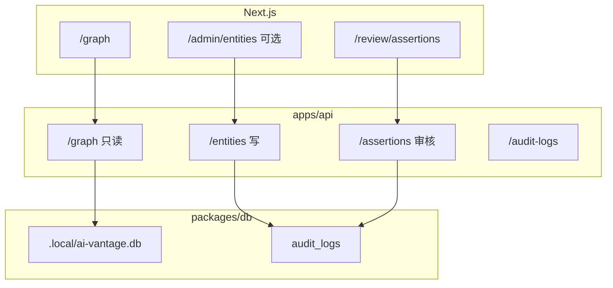

# M3 迭代规划：可维护图谱

> **状态：已完成** — 见 [m3-completion.md](./m3-completion.md)  
> 前置：**M2 已完成**（[m2-completion.md](./m2-completion.md)）  
> 基准：[investment-knowledge-graph-development-plan.md](./investment-knowledge-graph-development-plan.md) 里程碑 M3、§6.2–6.4、§7.6

---

## 一、M3 目标（一句话）

在 M2「只读图谱 API」之上，补齐 **写入、审核、追溯** 能力，使图谱可由人维护，并为 M4 AI 候选入库预留审核通道。

```text
人工/脚本维护 Entity/Relation
  → Assertion + Evidence 绑定
  → 审核队列（candidate → verified/active）
  → audit_log 记录每次变更
```

**M3 不做**（明确留给 M4/M5）：

- Worker、BullMQ、LLM 抽取
- `/research/*` 完整研究工作台
- `/agent` Agent 页面
- 文档 ingest、冲突自动检测

---

## 二、现状与差距

| 能力 | M2 现状 | M3 需补 |
|------|---------|---------|
| 读图谱 | ✅ `GET /graph*` | — |
| 写实体/关系 | ❌ | `POST/PATCH` entities、relations |
| Assertion 表 | ✅ schema 已建 | repository + API + 种子数据 |
| Evidence 表 | ✅ schema 已建 | repository + API |
| 审核流 | ❌ | verify / reject / deprecate |
| audit_logs | ✅ schema 已建 | 写入中间件 + 查询 API |
| 前端审核页 | ❌ | `/review/assertions` |
| 图谱详情里的判断/证据 | ❌ 仅 MDX 叙事 | 边/节点面板接 Assertion |

---

## 三、M3 里程碑验收（对齐文档 §M3）

| # | 验收项 | 可验证方式 |
|---|--------|------------|
| 1 | 可通过 API 创建/更新/废弃实体与关系 | curl / OpenAPI |
| 2 | 可创建 Assertion、绑定 Evidence | POST + link-evidence |
| 3 | 审核队列可列出 `candidate`，支持通过/拒绝 | `/review/assertions` UI |
| 4 | `active` 判断进入正式图谱查询（可选过滤） | GET /graph?status=active |
| 5 | 每次写操作写入 audit_log | GET /audit-logs |
| 6 | M2 只读能力不退化 | `pnpm test` 全绿 |

---

## 四、迭代拆分（建议 3–4 周）

### M3.1 写入基础设施（≈4–5 天）

**目标**：API 具备安全写库与审计能力。

| 任务 | 产出 |
|------|------|
| `packages/contracts` 扩展 | `CreateEntityDto`、`UpdateRelationDto`、`AssertionDto` 等 |
| `AssertionRepository`、`EvidenceRepository`、`AuditLogRepository` | `packages/db` |
| `audit-service` | 统一 `logChange(actor, action, target, before, after)` |
| Hono 中间件 | 错误处理、请求 ID（可选） |
| 写操作自动记 audit | entities/relations/assertions 变更 |

**API（首期）**：

```text
GET    /entities
GET    /entities/:id
POST   /entities
PATCH  /entities/:id
POST   /entities/:id/deprecate

GET    /relations
GET    /relations/:id
POST   /relations
PATCH  /relations/:id
POST   /relations/:id/deprecate

GET    /audit-logs?targetType=&targetId=
```

**验收**：Postman 创建一条测试 Company，audit_logs 有记录；`pnpm test:api` 扩展写用例。

---

### M3.2 Assertion / Evidence 与审核 API（≈4–5 天）

**目标**：投资判断可录入、可审核、可追溯证据。

| 任务 | 产出 |
|------|------|
| `AssertionService` | 状态机：`candidate → verified → active`，`reject`，`deprecated` |
| `EvidenceService` | CRUD + 关联 assertion |
| 路由 | §6.4 全部端点 |

```text
GET    /assertions?status=candidate
GET    /assertions/:id
POST   /assertions
PATCH  /assertions/:id
POST   /assertions/:id/verify
POST   /assertions/:id/reject
POST   /assertions/:id/deprecate
POST   /assertions/:id/link-evidence

GET    /evidences
GET    /evidences/:id
POST   /evidences
```

**种子数据（演示用）**：

- 从现有 MDX 投资逻辑手工抽 5–10 条 `Assertion`（`status: active`）
- 每条挂 1 条 `Evidence`（`platform_article`，指向对应 layer/target MDX）
- 不依赖 AI Worker

**图谱查询扩展（可选）**：

- `GET /graph` 增加 `?includeAssertions=true` 或独立 `GET /entities/:id/assertions`
- `GET /relations/:id` 返回关联 assertionIds

**验收**：DB 内 candidate 经 verify 变 active；拒绝后不出现在 active 列表。

---

### M3.3 审核队列 UI（≈4–5 天）

**目标**：运营/研究员可在 Web 完成审核，无需 curl。

| 任务 | 产出 |
|------|------|
| `src/lib/api-client.ts` 扩展 | 审核、实体 CRUD 的 typed fetch |
| 页面 `/review/assertions` | 列表 + 详情侧栏 |
| 组件 | `AssertionReviewCard`、证据原文展示、操作按钮 |
| 导航 | [navigation.tsx](../src/components/navigation.tsx) 增加「审核」入口 |
| 图谱详情增强 | [detail-panel.tsx](../src/components/graph/detail-panel.tsx) 展示关联 Assertion（只读） |

**页面能力**：

- 按状态筛选：`candidate` / `verified` / `rejected`
- 查看 `claimText`、主体/客体实体名、confidence
- 展开 Evidence（sourceTitle、evidenceSpan）
- 操作：通过、拒绝、标记过期（含确认）
- 空状态：无 candidate 时引导「M4 将支持文档入库」

**验收**：本地 seed 后打开审核页，处理一条 candidate 后图谱详情可见 active 判断。

---

### M3.4 实体维护与图谱联动（≈3–4 天，可并行/裁剪）

**目标**：轻量后台，不必做完整 Admin。

| 任务 | 产出 |
|------|------|
| `/admin/entities` 或 `/review/entities` | 实体列表 + 编辑表单（JSON properties 编辑器可简化） |
| 关系列表 | 按实体查看入边/出边，支持废弃 |
| `GET /graph` 与维护一致性 | 废弃实体/关系不出现在 active 子图 |
| E2E 冒烟（可选） | 审核通过一条 + 图谱仍 32/71 基线 |

**裁剪方案**（时间紧时）：

- 仅 API + OpenAPI，UI 只做审核页；实体编辑延后到 M3.5

---

## 五、架构示意



---

## 六、数据与状态规则（M3 必守）

### 6.1 图谱可见性

| 对象 | 进入 `GET /graph` 条件 |
|------|------------------------|
| Entity | `status = active` |
| Relation | `status = active` 且两端实体 active |
| Assertion | **默认不画进图谱边**；在详情面板/审核页展示 |

### 6.2 审核状态流

```text
candidate ──verify──► verified ──publish──► active
    │                      │
    reject                 deprecated
    ▼
 rejected
```

M3 实现：`verify` 可直接到 `active`（简化，少一步 publish）。

### 6.3 Audit log 字段

```text
actor_type: user | system
action: create | update | verify | reject | deprecate | link_evidence
target_type: entity | relation | assertion | evidence
```

---

## 七、文件规划（新建/重点改）

```text
packages/contracts/src/
  entities.ts
  assertions.ts
  evidences.ts
  audit.ts

packages/db/src/repositories/
  assertion-repository.ts
  evidence-repository.ts
  audit-log-repository.ts

apps/api/src/
  routes/entities.ts
  routes/relations.ts
  routes/assertions.ts
  routes/evidences.ts
  routes/audit-logs.ts
  services/entity-service.ts
  services/assertion-service.ts
  services/audit-service.ts
  middleware/audit.ts

src/app/review/assertions/page.tsx
src/components/review/
src/lib/admin-api-client.ts   # 或扩展 api-client.ts

content/seed/                   # 可选：m3-assertions.json
scripts/seed-m3-demo.ts
```

---

## 八、环境与脚本

```bash
# 现有
pnpm db:migrate && pnpm db:seed      # 图谱基线 32/71

# M3 新增建议
pnpm db:seed:m3-demo                 # 演示用 assertions/evidences
pnpm test:api                        # 含写操作 + 审核流
pnpm dev:stack
```

`.env` 无新增必填项；审核页仅调 `NEXT_PUBLIC_API_URL`。

---

## 九、风险与缓解

| 风险 | 缓解 |
|------|------|
| 写接口破坏只读图谱 | 写库与 graph-repository 分离；CI 先跑只读测试再跑写测试 |
| Assertion 与 Relation 语义重叠 | M3 仅展示，不自动同步为边；M4 再讨论生成规则 |
| UI 范围膨胀 | 审核页优先；实体 Admin 可砍到 M3.5 |
| 无登录体系 | `actor_id` 用固定 `local-dev` 或 header `X-Actor-Id` |

---

## 十、与 M4/M5 的边界

| 里程碑 | 依赖 M3 | 新增 |
|--------|---------|------|
| **M4** AI 候选 | 审核队列、Evidence 模型 | Worker、文档 ingest、候选 Assertion 入库 |
| **M5** 研究工作台 | 实体/判断 API | `/research/*`、`/agent`、主题/标的视图 |

---

## 十一、建议执行顺序

```text
M3.1 写基础设施 + audit_log + entities/relations API
  → M3.2 assertions/evidences API + demo seed
  → M3.3 /review/assertions UI + 图谱详情 Assertion
  → M3.4 轻量实体维护（可选）
  → 文档 m3-completion.md + 更新 README-KG
```

**首期最小可交付（M3-MVP）**：完成 M3.1 + M3.2 + M3.3，即「能审、能记、能查日志」，实体 Admin 可后补。

---

## 十二、成功标准（M3 完成定义）

1. 至少 1 条手工 Assertion 经审核进入 `active`，并在标的/层级详情中可见。  
2. Evidence 可绑定并可从 Assertion 详情查看原文片段。  
3. `/review/assertions` 可完成通过/拒绝，操作写入 audit_log。  
4. `GET /graph` 仍返回 32/71 基线（除非故意废弃测试数据）。  
5. `pnpm test` 覆盖审核状态机与 audit 写入。  

确认本规划后，按 **M3.1 → M3.3（+ 可选 M3.4）** 开始实施。
