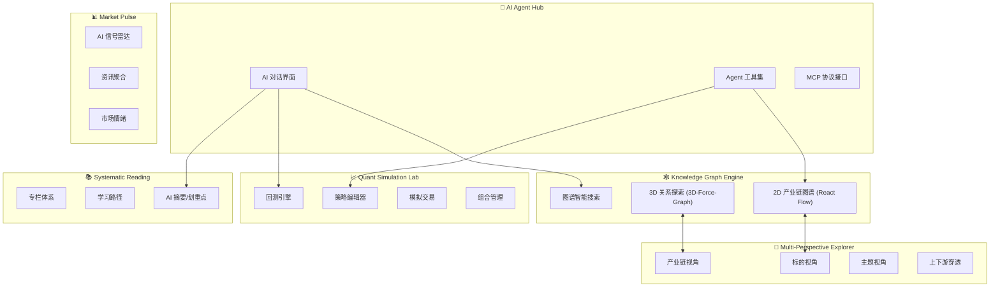
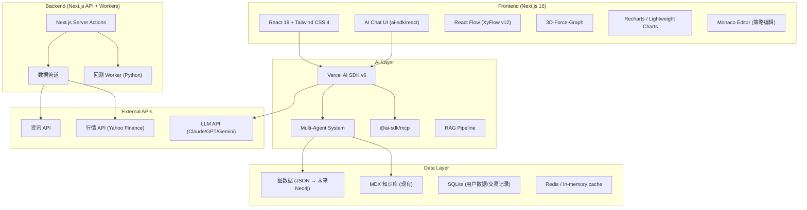

# AI Vantage 2.0 — AI 原生投资智能体平台

## 产品愿景

**将 AI Vantage 从一个静态的 AI 产业投资分析阅读站，彻底升级为 AI Agent Native 的投资智能体平台。**

核心理念：**"AI 研究 AI 投资"** — 用 AI 智能体来辅助理解、分析、模拟 AI 产业的投资机会。

---

## 一、现状分析

### 当前项目已有能力

| 模块 | 状态 | 说明 |
|------|------|------|
| 产业七层架构 | ✅ 已完成 | 7 层 × 17 家公司标的的 MDX 内容 |
| 知识图谱（React Flow） | ✅ 基础版 | `@xyflow/react` 已集成，`relations.json` 定义了 34 个节点、70+ 条边 |
| 电子书阅读 | ✅ 已完成 | MDX + next-mdx-remote 渲染 |
| 版本演变时间线 | ✅ 已完成 | 追踪投资逻辑变更 |
| 探索视图 | ✅ 已完成 | 按层级/标的逐层钻取 |
| 投资概念体系 | ✅ 已完成 | 8 个核心概念（护城河、周期vs结构等） |

### 当前技术栈

- **框架**: Next.js 16 + React 19 + TypeScript
- **样式**: Tailwind CSS 4 + shadcn/ui
- **图谱**: `@xyflow/react` (XyFlow v12)
- **内容**: MDX + gray-matter + next-mdx-remote
- **主题**: next-themes（深色模式支持）

---

## 二、产品设计 — 六大核心模块

### 模块架构全景



---

### 模块 1: 🧠 AI Agent Hub — AI 智能体中枢

> **产品定位**: 整个平台的"大脑"，所有交互的智能入口

#### 1.1 AI 对话界面 (Chat Interface)

- **自然语言提问**: "英伟达上游依赖哪些公司？"、"帮我分析 HBM 产业链的投资逻辑"
- **多轮对话 + 记忆**: 支持上下文连续对话，Agent 记住用户的投资偏好和研究历史
- **可视化回答**: Agent 回复可以嵌入图谱片段、K线图、数据表格，不仅仅是文本
- **Human-in-the-Loop**: 关键决策（如模拟交易下单）需要用户确认

#### 1.2 Agent 工具集 (Tool Calling)

Agent 可调用的内置工具：

| 工具名 | 能力 | 示例 |
|--------|------|------|
| `query_knowledge_graph` | 查询知识图谱 | "查找所有与台积电有供应关系的公司" |
| `analyze_industry_chain` | 产业链分析 | "分析 HBM 上下游完整链条" |
| `get_market_data` | 获取行情数据 | "获取英伟达最近30天的股价" |
| `run_backtest` | 执行回测 | "用均线策略回测英伟达过去1年表现" |
| `search_articles` | 搜索专栏文章 | "查找关于护城河类型的所有文章" |
| `compare_targets` | 标的对比 | "对比 SK海力士 和 三星 的投资价值" |
| `generate_report` | 生成研报 | "生成芯片设计层的月度投资简报" |
| `sentiment_analysis` | 情绪分析 | "分析市场对 CoreWeave 的最新情绪" |

#### 1.3 Multi-Agent 协作架构

```
┌─────────────────────────────────────────────┐
│              Orchestrator Agent              │
│         (路由、任务分解、结果汇总)             │
└──────┬──────────┬──────────┬────────────────┘
       │          │          │
  ┌────▼───┐ ┌───▼────┐ ┌──▼──────┐
  │Research │ │Quant   │ │Graph    │
  │Agent   │ │Agent   │ │Agent    │
  │(研究)  │ │(量化)  │ │(图谱)   │
  └────────┘ └────────┘ └─────────┘
```

- **Orchestrator Agent**: 接收用户请求，分解任务，路由到专业 Agent
- **Research Agent**: 负责深度研究、文章搜索、信息综合
- **Quant Agent**: 负责策略设计、回测执行、组合优化
- **Graph Agent**: 负责图谱查询、关系推理、路径发现

---

### 模块 2: 🕸️ Knowledge Graph Engine — 知识图谱引擎

> **产品定位**: 用可视化方式揭示 AI 产业错综复杂的关系网络

#### 2.1 2D 产业链图谱 (React Flow + ELK.js)

**升级方向**: 从当前静态图谱升级为交互式、可编辑、带实时数据的智能图谱

- **分层布局 (ELK.js)**: 自动按产业层级排列，清晰展示上下游关系
- **Rich Node Cards**: 每个节点是一个信息丰富的 React 组件卡片
  - 公司名 + Logo
  - 实时股价 / 市值变化
  - 投资评级 badge
  - 关键指标 sparkline
- **Edge 语义化**: 不同关系类型用不同颜色/样式（供应→蓝色、竞争→红色、威胁→橙色虚线）
- **筛选 & 高亮**: 按关系类型、层级、确定性等维度过滤
- **路径发现**: "从 ASML 到 OpenAI 的所有连接路径"
- **聚焦模式**: 点击任一节点，高亮其 1 跳 / 2 跳关联，其余灰化

#### 2.2 3D 关系探索 (3D-Force-Graph)

**用途**: 发现隐藏的集群和关系模式

- **全景鸟瞰**: 在 3D 空间中旋转、缩放整个 AI 产业版图
- **力导向布局**: 自然聚类，同层级公司自动靠近
- **节点大小 = 市值/重要性**: 视觉权重直观表达
- **粒子动画边**: 供应链关系用流动粒子表示方向
- **点击穿透**: 3D 中点击节点可弹出详细面板

#### 2.3 图谱智能搜索

- **自然语言查询**: "谁在和博通竞争 ASIC 设计？"
- **图谱 + RAG 混合检索**: 结合图结构查询和文本语义搜索
- **可视化查询结果**: 搜索结果直接在图谱上高亮

---

### 模块 3: 📈 Quant Simulation Lab — 量化模拟实验室

> **产品定位**: 模拟交易 + 策略回测，用数据验证投资逻辑（纯模拟，不实仓）

#### 3.1 策略编辑器

- **可视化策略构建器**: 拖拽式，用 React Flow 节点表示策略逻辑
  - 信号节点（均线交叉、RSI、MACD 等）
  - 条件节点（AND/OR/阈值）
  - 执行节点（买入/卖出/持仓）
- **代码编辑器**: 高级用户可直接写 TypeScript/Python 策略
- **AI 辅助策略**: 用自然语言描述策略，Agent 自动生成代码
  - "当英伟达连续3天放量上涨且RSI低于70时买入，跌破20日均线时卖出"

#### 3.2 回测引擎

- **前端展示 + 后端计算**: 前端负责配置和展示，重计算逻辑后端执行
- **回测报告**: 收益曲线、最大回撤、夏普比率、胜率、盈亏比
- **对比回测**: 多策略并行对比 + 与基准（如 QQQ、SOXX）对比
- **行业主题回测**: "按七层架构做等权组合，回测3年表现"

#### 3.3 模拟交易 (Paper Trading)

- **虚拟资金账户**: 初始 100 万虚拟美元
- **实时行情模拟**: 使用延迟行情数据（Yahoo Finance / Alpha Vantage 免费 API）
- **持仓管理**: 查看盈亏、调仓、止盈止损
- **交易日志**: 每笔模拟交易记录，支持 Agent 复盘分析

#### 3.4 AI 组合管理

- **AI 推荐组合**: 基于产业分析自动生成建议组合
- **风险评估**: 行业集中度、相关性矩阵、VaR 计算
- **再平衡提醒**: 定期提醒用户按逻辑再平衡

---

### 模块 4: 📚 Systematic Reading Center — 系统化阅读中心

> **产品定位**: 不仅仅是文章列表，而是一套有体系的投资知识课程

#### 4.1 知识专栏体系

```
📚 专栏架构
├── 🏗️ AI 产业结构 (现有内容升级)
│   ├── 七层解析
│   ├── 公司深度
│   └── 概念图谱
├── 📖 投资方法论
│   ├── 价值投资基础
│   ├── 产业链分析方法
│   ├── 护城河评估框架
│   └── 估值方法对比
├── 📊 量化基础
│   ├── 技术分析入门
│   ├── 因子模型
│   └── 风险管理
├── 🌍 宏观视角
│   ├── AI 政策跟踪
│   ├── 中美科技竞争
│   └── 全球半导体格局
└── 📝 实战案例
    ├── 历史投资复盘
    ├── 经典泡沫分析
    └── AI 时代投资案例
```

#### 4.2 学习路径

- **小白路径**: 投资基础 → 产业认知 → 实操入门
- **进阶路径**: 深度产业研究 → 量化分析 → 策略构建
- **研究员路径**: 产业链穿透 → 跨市场分析 → 投资框架搭建
- **进度追踪**: 已读/未读、阅读时间统计、学习打卡

#### 4.3 AI 辅助阅读

- **AI 摘要**: 每篇文章自动生成 3 句话摘要
- **AI 划重点**: 标注关键论点和数据
- **AI 提问**: 读完文章后，AI 出测试题检验理解
- **关联推荐**: "读完护城河类型，推荐阅读: 物理级壁垒 → 周期性vs结构性"
- **AI 笔记助手**: 用户划线标注后，AI 帮助整理成结构化笔记

---

### 模块 5: 🔭 Multi-Perspective Explorer — 多视角穿透分析

> **产品定位**: 同一数据，多种视角，让用户从不同维度理解投资机会

#### 5.1 标的视角

- **公司全景卡片**:
  - 基本面信息 (市值、PE、营收增速)
  - 所属产业层级
  - 上游依赖（原材料/设备供应商）
  - 下游客户
  - 竞争对手
  - 潜在威胁
  - AI 分析摘要
- **一键穿透**: 从英伟达 → 上游(台积电、SK海力士) → 再上游(ASML)

#### 5.2 产业链视角

- **链条式可视化**: 横向展示完整产业链
  ```
  光刻机 → 代工 → HBM → GPU设计 → 算力云 → AI模型 → 应用
  ASML    台积电  SK海力士  英伟达    AWS     OpenAI   应用层
  ```
- **龙头标注**: 每个环节标注龙头公司、份额、壁垒高度
- **链条健康度**: 用颜色表示每个环节的投资确定性

#### 5.3 主题视角

- **投资主题**: "HBM 产业链"、"AI 算力自研"、"开源模型生态"
- **主题内聚合**: 一个主题下聚合所有相关标的、概念、文章
- **跨主题关联**: 发现不同主题间的共振和对冲关系

#### 5.4 上下游穿透

- **N 跳穿透**: 从任一节点出发，展开 1-3 跳的上下游关系
- **影响传导分析**: "如果 ASML EUV 产能受限，哪些下游公司受影响最大？"
- **供应链风险图**: 标注单点依赖（如台积电对 ASML 的依赖）

---

### 模块 6: 📊 Market Pulse Dashboard — 市场脉搏看板

> **产品定位**: 实时感知 AI 产业的市场温度

#### 6.1 AI 信号雷达

- **异动检测**: 自动检测 AI 产业标的的异常波动
- **事件关联**: 将市场异动与产业事件关联（如新芯片发布 → 股价反应）
- **信号评级**: AI 对信号的重要性进行评级

#### 6.2 资讯聚合

- **多源聚合**: 整合 AI/半导体/投资相关资讯
- **AI 分类**: 自动按产业层级/标的/主题分类
- **关键事件时间线**: 重大事件按时间线展示

#### 6.3 市场情绪仪表盘

- **恐贪指数**: AI 产业专属的恐惧&贪婪指数
- **社交情绪**: 分析社交媒体对各标的的讨论热度
- **机构动向**: 跟踪大型机构对 AI 标的的持仓变化

---

## 三、技术选型

### 整体架构



### 详细技术选型

#### 前端层

| 技术 | 选择 | 理由 |
|------|------|------|
| **框架** | Next.js 16 (保持) | 已有基础，Server Actions + Server Components 完美契合 AI 应用 |
| **UI** | React 19 + shadcn/ui (保持) | 已有基础，组件丰富 |
| **样式** | Tailwind CSS 4 (保持) | 已有基础，快速开发 |
| **2D 图谱** | `@xyflow/react` v12 (保持) + `elkjs` (新增) | 已集成，ELK.js 负责自动布局 |
| **3D 图谱** | `react-force-graph-3d` (新增) | 基于 ThreeJS/WebGL，大规模图谱探索 |
| **图表/K线** | `lightweight-charts` (新增) | TradingView 开源 K 线库，金融级别 |
| **数据图表** | `recharts` (新增) | React 生态最成熟的图表库 |
| **代码编辑器** | `@monaco-editor/react` (新增) | VS Code 同款编辑器，策略编写 |
| **Markdown 渲染** | `next-mdx-remote` (保持) | 已有基础 |

#### AI 层

| 技术 | 选择 | 理由 |
|------|------|------|
| **AI SDK** | `ai` (Vercel AI SDK v6) | TypeScript 原生，Next.js 深度集成，支持 Agent + Tool Calling + Streaming |
| **MCP 协议** | `@ai-sdk/mcp` | 标准化工具接口，可无缝接入外部 MCP Server |
| **LLM Provider** | `@ai-sdk/anthropic` + `@ai-sdk/openai` + `@ai-sdk/google` | 多模型切换，通过 AI SDK 统一接口 |
| **RAG** | AI SDK + 自建向量检索 | 将 MDX 内容 + 图谱数据向量化后做混合检索 |
| **Agent 架构** | AI SDK `generateText` + Tool Loop | AI SDK v6 原生支持，无需引入 LangGraph |
| **结构化输出** | Zod schema | AI SDK 原生集成 Zod，确保工具调用类型安全 |

> [!IMPORTANT]
> **为什么选 Vercel AI SDK 而不是 LangChain/LangGraph？**
> - 项目是 TypeScript + Next.js 全栈，AI SDK 是最原生的选择
> - AI SDK v6 已经内置了 Agent 抽象、Tool Loop、MCP 支持
> - 无需引入 Python 依赖（LangGraph Python 版），架构更简洁
> - Server Actions 集成让 AI 流式响应零配置
> - 如果未来需要更复杂的 Agent 编排，可以引入 `@langchain/langgraph` JS 版本

#### 数据层

| 技术 | 选择 | 理由 |
|------|------|------|
| **知识内容** | MDX 文件 (保持) | 已有 7 层 + 17 标的 + 8 概念，继续扩展 |
| **图谱数据** | JSON → Phase 2 考虑 Neo4j | Phase 1 保持 JSON 足够，关系不超过 500 条时性能无忧 |
| **用户数据** | `better-sqlite3` 或 `drizzle-orm` + SQLite | 轻量级、无需外部数据库、本地持久化 |
| **向量存储** | `@xenova/transformers` (本地嵌入) 或 `pgvector` | Phase 1 用本地嵌入 + 内存搜索，Phase 2 上 pgvector |
| **缓存** | Next.js 内置缓存 + `unstable_cache` | 行情数据、AI 响应缓存 |

#### 外部 API

| 用途 | 推荐 API | 免费额度 |
|------|----------|----------|
| **美股行情** | Yahoo Finance (非官方) / Alpha Vantage | Yahoo 无限制 / Alpha 500次/天 |
| **实时报价** | Finnhub | 60次/分钟免费 |
| **资讯** | NewsAPI / Finnhub News | 有免费额度 |
| **中国A股** | Tushare / AKShare | 免费开源 |

---

## 四、信息架构 & 页面规划

### 导航结构

```
AI Vantage 2.0
├── 🏠 首页 (/)                        — 全景 Dashboard + 快速入口
├── 🧠 AI 助手 (/chat)                  — AI 对话界面
├── 🕸️ 图谱 (/graph)                    — 知识图谱浏览
│   ├── 2D 产业链 (/graph/2d)
│   └── 3D 探索 (/graph/3d)
├── 🔭 探索 (/explore)                  — 多视角分析
│   ├── 按标的 (/explore/target/[slug])
│   ├── 按产业链 (/explore/chain/[slug])
│   ├── 按层级 (/explore/layer/[slug])
│   └── 按主题 (/explore/theme/[slug])
├── 📈 量化实验室 (/lab)                — 模拟交易 & 回测
│   ├── 策略工坊 (/lab/strategy)
│   ├── 回测 (/lab/backtest)
│   ├── 模拟交易 (/lab/paper-trade)
│   └── 组合管理 (/lab/portfolio)
├── 📚 阅读 (/read)                     — 系统化阅读
│   ├── 专栏列表 (/read/columns)
│   ├── 学习路径 (/read/paths)
│   └── 文章详情 (/read/[slug])
├── 📊 市场脉搏 (/pulse)               — 实时看板
│   ├── 信号雷达 (/pulse/signals)
│   └── 资讯流 (/pulse/news)
└── ⚙️ 设置 (/settings)
    ├── API Key 配置
    ├── 模型选择
    └── 虚拟账户管理
```

### 首页 Dashboard 设计

```
┌─────────────────────────────────────────────────┐
│  AI Vantage 2.0          [搜索] [🌙] [设置]      │
├─────────────────────────────────────────────────┤
│ ┌───────────────────────────────────────────┐   │
│ │  💬 AI 快问快答 (展开后进入完整聊天)         │   │
│ │  "问我任何关于 AI 投资的问题..."             │   │
│ └───────────────────────────────────────────┘   │
│                                                 │
│ ┌──────────┐ ┌──────────┐ ┌──────────┐        │
│ │ 📊 今日   │ │ 🔴 异动   │ │ 📈 组合   │        │
│ │ AI板块   │ │ 标的3个  │ │ +2.3%   │        │
│ │ +1.2%   │ │          │ │          │        │
│ └──────────┘ └──────────┘ └──────────┘        │
│                                                 │
│  七层速览                                       │
│ ┌──────────────────────────────────────────┐   │
│ │ [1]物理工程 ▓▓▓▓▓▓▓▓▓  +2.1%  ASML ↑   │   │
│ │ [2]寡头垄断 ▓▓▓▓▓▓▓    +1.8%  SK ↑     │   │
│ │ [3]云平台   ▓▓▓▓▓      +0.9%  AWS ↓    │   │
│ │ [4]应用模型 ▓▓▓▓▓▓     +1.5%  MSFT ↑   │   │
│ │ [5]芯片设计 ▓▓▓▓▓▓▓▓   +2.4%  NVDA ↑   │   │
│ │ [6]中间挤压 ▓▓▓         -0.3%  CRWV ↓   │   │
│ │ [7]零壁垒   ▓▓          -1.1%           │   │
│ └──────────────────────────────────────────┘   │
│                                                 │
│ ┌─────────────────┐ ┌────────────────────┐     │
│ │  📚 继续阅读     │ │  🕸️ 图谱快照       │     │
│ │  上次看到:       │ │  [交互式迷你图谱]   │     │
│ │  芯片设计层 Ch.5 │ │                    │     │
│ └─────────────────┘ └────────────────────┘     │
└─────────────────────────────────────────────────┘
```

---

## 五、分阶段实施路线图

### Phase 1: AI Agent 基础 + 图谱增强（3-4 周）

**目标**: 引入 AI 能力，升级知识图谱

- [ ] 集成 Vercel AI SDK v6，搭建 AI 对话界面
- [ ] 实现基础 Tool Calling（知识图谱查询、文章搜索、标的分析）
- [ ] ELK.js 自动布局升级现有 React Flow 图谱
- [ ] Rich Node Cards（带投资评级、层级标签）
- [ ] 图谱筛选/高亮/聚焦功能
- [ ] 路径发现算法
- [ ] 3D-Force-Graph 基础版
- [ ] 首页 Dashboard 重设计
- [ ] 导航体系重构

### Phase 2: 多视角分析 + 阅读体系（2-3 周）

**目标**: 深化内容体系和分析维度

- [ ] 产业链视角可视化
- [ ] 上下游穿透功能
- [ ] 主题视角聚合
- [ ] 专栏体系搭建
- [ ] 学习路径设计
- [ ] AI 摘要/划重点功能
- [ ] 关联推荐系统
- [ ] 更多内容填充（投资方法论、量化基础等）

### Phase 3: 量化模拟实验室（3-4 周）

**目标**: 实现回测和模拟交易

- [ ] 行情数据接入（Yahoo Finance / Alpha Vantage）
- [ ] K 线图表组件（Lightweight Charts）
- [ ] 可视化策略编辑器
- [ ] 回测引擎（前端展示 + 后端计算）
- [ ] 回测报告可视化
- [ ] 虚拟资金账户
- [ ] 模拟交易界面
- [ ] 持仓管理
- [ ] AI 组合推荐

### Phase 4: 市场脉搏 + 高级特性（2-3 周）

**目标**: 实时数据 + 智能信号

- [ ] 异动检测算法
- [ ] 资讯聚合与分类
- [ ] 市场情绪仪表盘
- [ ] MCP Server 接入（扩展外部工具）
- [ ] Multi-Agent 协作
- [ ] 用户设置管理（API Key、模型选择）
- [ ] 性能优化 & 打磨

---

## 六、关键设计决策

### 决策 1: 数据存储策略

**推荐: 渐进式**
- Phase 1-2: 保持 MDX + JSON 文件，零运维成本
- Phase 3+: 引入 SQLite（用户数据/交易记录）
- 未来: 如果图谱复杂度爆炸（>1000 节点），考虑 Neo4j

### 决策 2: LLM 模型策略

**推荐: 用户自带 API Key（BYOK）**
- 用户在设置页面配置自己的 API Key
- 支持 Claude / GPT / Gemini 切换
- 降低运营成本，用户控制消费

### 决策 3: 回测引擎位置

**推荐: Hybrid**
- 简单策略（均线、RSI 等）: 前端 TypeScript 直接计算
- 复杂策略: 后端 Python Worker（通过 Next.js API Route 调用）
- Phase 1 先做前端版本，Phase 3 按需上 Python Worker

### 决策 4: 部署策略

**推荐: Vercel（前端）+ Serverless（后端 Worker）**
- Next.js 部署到 Vercel 或自托管
- 回测 Worker 如果上 Python，用 Modal / Railway / 自己的服务器

---

## Open Questions

> [!IMPORTANT]
> ### 需要你确认的问题

1. **目标用户是谁？**
   - A. 个人投资者（散户）→ 偏重教育 + 简单工具
   - B. 投资研究爱好者 → 偏重深度分析 + 图谱
   - C. 专业分析师 → 偏重量化 + 数据
   - D. 以上皆是，但有优先级？

2. **内容范围是否仅限 AI 产业？**
   - 当前内容聚焦 AI 产业链，未来是否扩展到整个科技投资（半导体、SaaS、新能源等）？

3. **国际化考虑？**
   - 仅中文？中英双语？
   - 标的范围：仅美股？美股+A股+港股？

4. **Phase 1 优先级排序** — 以下哪些最想先看到？
   - A. AI 对话界面（能和 AI 聊投资）
   - B. 增强版知识图谱（3D + 自动布局 + 路径发现）
   - C. 首页 Dashboard 重设计
   - D. 全部同时推进

5. **是否需要用户认证系统？**
   - 多用户支持？还是单用户本地使用？

6. **回测数据源偏好？**
   - 免费数据（Yahoo Finance，有延迟/限制）
   - 付费数据（IEX Cloud、Polygon.io，更稳定）
   - 用户自带数据源

7. **这个产品的最终形态是？**
   - A. 个人研究工具（本地运行，自己用）
   - B. SaaS 产品（多用户，商业化）
   - C. 开源项目（社区驱动）
   - D. 先 A，再逐步向 B/C 演进

---

## 验证计划

### 自动化测试
- Next.js `build` 确保无编译错误
- 关键组件单元测试（图谱数据处理、策略引擎）
- E2E 测试核心流程（AI 对话、图谱交互、模拟交易）

### 手动验证
- 浏览器内测试所有页面路由
- AI 对话多轮交互测试
- 图谱大数据量渲染性能测试
- 移动端响应式验证
